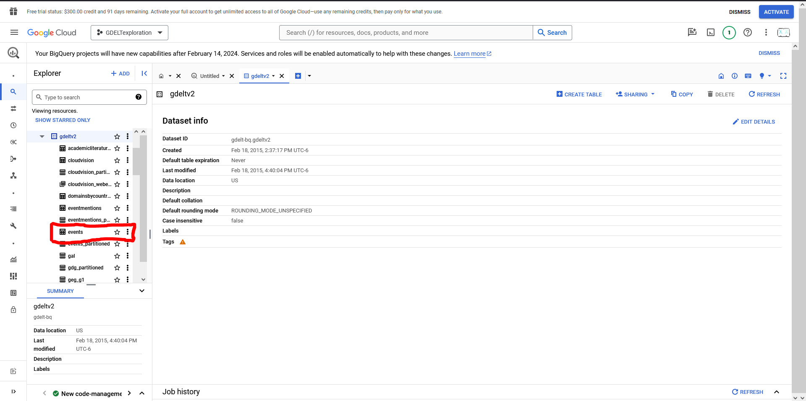

# Get data from Googles's [BigQuery](https://cloud.google.com/bigquery?hl=en&authuser=1)

*BigQuery is a serverless and cost-effective enterprise data warehouse that works across clouds and scales with your data. Use built-in ML/AI and BI for insights at scale.*

In other words, it's a place where you can store really big datasets and extract just get the information you need using [SQL](https://aws.amazon.com/what-is/sql/) with having to store several TB of data.

Note that this is **not a free service** when the dataset is stored outside of your country. For instance, you will be charged if you are in Mexico but want to download data stored in the U.S. For a more detailed information click [here](https://cloud.google.com/bigquery/pricing).

This notes will guide you to get your first query results from BigQuery using the GDELT 2.0 Events as an example.

# Create a Google Console Account

1. Clikc on the following [link](https://cloud.google.com/bigquery?hl=en) and click on *Try BigQuery free*:


2. Sign in into your Google account.

3. Set up your country.


4. Set up your payment. With the free trial you will get $300 in queries for free for a 90 days.


5. Finish the account creating with some descriptions


6. You should have access to your Google Cloud Console.


7. Create your first project by clicking on the top left were it says **My First Project**. Note that *My First Project* is automatically created for you. But we will need to set up a new one with access to the BigQuery API.


8. Click on  **NEW PROJECT**.


9. Name your new project. I chose to use *GDELTexploration*.


10. You will be redirected to the main page of Google Cloud. Now select **My First Project** and change to the new project.


11. You should now see **YOUR PROJECT NAME** at the top left.


12. Now we need to enable the BigQuery API. For that expand the options on the top left corner and select *BigQuery*.


13. Click on **ENABLE**.


14. You will be redirected to the BigQuery console


Now you can use BigQuery as you please. 

## Downloading Data from GDELT

1. Access BigQuery Console by clicking [here](https://console.cloud.google.com/bigquery).

2. Select on the **+** button to open a text editor. 


3. Copy and paste the following SQL code

```sql
    SELECT
    ActionGeo_Lat, ActionGeo_Long, ActionGeo_FeatureID, Actor1Type1Code, Actor2Type1Code, SQLDATE, Year
    FROM
    `gdelt-bq.full.events`
    WHERE 
    ActionGeo_CountryCode = 'CI' -- Subset for Chile
    AND EventRootCode = '14' -- Subset Protest
```


Notice that we are pulling data from the `gdelt-bq.full.events` (or GDELT 2.0 Events database), subseting for protest events that happened in Chile.

Another thing to note is the amount of data that this SQL will pull.


This query will pull around 36 GB, which is usually a number with no limit and no charge if you live in the U.S. There are data limitations on how much data you can pull from BigQuery and if you exceed that amount you might get charged. Please refer to [BigQuery's Pricing Policy](https://cloud.google.com/bigquery/pricing) for more information.

4. Hit on **RUN**.


5. When the script finishes running you will have the following results in the bottom panel:


6. The last step would be to export or download the dataset. Select on **SAVE RESULTS** and chose the option you would like to use. 


## Explore the GDELT dataset

If we want to explore what other variables there are in GDELT inside BigQuery we can search for it in the public databases.

1. First we need to add a new dataset to the project. Click on the **+ ADD** button.


2. A new panel on the right will show up. Scroll down until you see **Public Datasets**


3. Search for *gdelt* in the search bar and click on the **GDELT 2.0 Event Database**.


4. Click and select **VIEW DATASET**.


5. Now the GDELT public dataset is added to your projects browser. To see the varaibles in the events dataset click on **gdeltv2**. Under this tab click on the **events** tab.




6. Now you can browse the variables and descriptions of the dataset.


You can find a more detailed description of [GDELT Project](https://www.gdeltproject.org/) datasets in the following [link](https://blog.gdeltproject.org/the-datasets-of-gdelt-as-of-february-2016/).

# ADVANCED: BigQuery from Python

*coming soon*